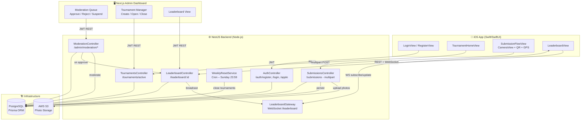

# FishLeague MVP – Architecture

## System Diagram



## Submission Flow (Happy Path)

```mermaid
sequenceDiagram
    participant App as iOS App
    participant API as NestJS API
    participant S3
    participant DB as PostgreSQL
    participant WS as WebSocket Gateway
    participant Admin

    App->>API: POST /submissions (multipart: 2 photos + metadata)
    API->>API: Validate JWT
    API->>DB: Check tournament open & in window
    API->>API: Validate GPS inside region bounding box
    API->>DB: Validate mat serial not reused by another user
    API->>API: Compute MD5 hashes; check for duplicates
    API->>S3: Upload photo1, photo2
    API->>DB: Create Submission (status=PENDING)
    API-->>App: { submissionId, status: "PENDING" }

    Admin->>API: POST /admin/moderation/:id/action { action: "APPROVE" }
    API->>DB: Update Submission status=APPROVED
    API->>DB: Upsert LeaderboardEntry (keep longest fish)
    API->>DB: Recompute ranks
    API->>WS: broadcastLeaderboardUpdate(tournamentId, top25)
    WS-->>App: leaderboard:update event
```

## Anti-Cheat Summary

| Check | Layer | Action |
|-------|-------|--------|
| QR must be in frame | iOS (AVFoundation) | Block capture button |
| GPS inside region bounding box | Server (SubmissionsService) | 400 rejection |
| Submission within tournament window | Server | 400 rejection |
| QR not reused by another account | Server (DB query) | 400 rejection |
| Duplicate image hash | Server (MD5) | Flag for moderation |
| Repeated GPS coordinates | Server (count query) | Flag for moderation |
| Prize positions manual review | Admin dashboard | Required before payout |
```
