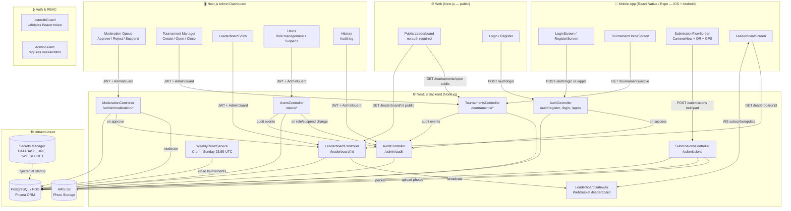
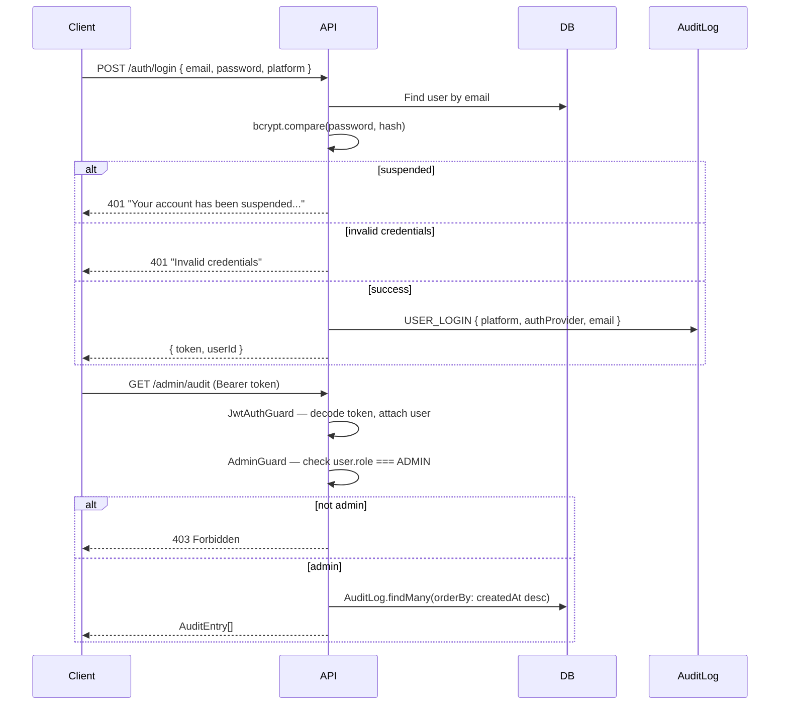
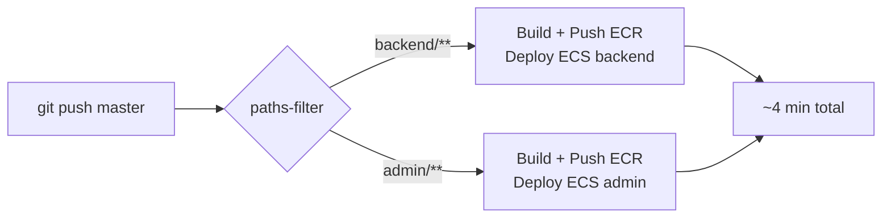

# FishLeague – Architecture

## System Diagram



## Submission Flow (Happy Path)

```mermaid
sequenceDiagram
    participant App as Mobile App
    participant API as NestJS API
    participant S3
    participant DB as PostgreSQL
    participant WS as WebSocket Gateway
    participant Admin

    App->>API: POST /submissions (multipart: 2 photos + metadata)
    API->>API: Validate JWT
    API->>DB: Check tournament open & in window
    API->>API: Validate GPS inside region bounding box
    API->>DB: Validate mat serial not reused by another user
    API->>API: Compute MD5 hashes; check for duplicates
    API->>S3: Upload photo1, photo2
    API->>DB: Create Submission (status=PENDING)
    API-->>App: { submissionId, status: "PENDING" }

    Admin->>API: POST /admin/moderation/:id/action { action: "APPROVE" }
    API->>DB: Update Submission status=APPROVED
    API->>DB: Upsert LeaderboardEntry (keep longest fish)
    API->>DB: Recompute ranks
    API->>WS: broadcastLeaderboardUpdate(tournamentId, top25)
    WS-->>App: leaderboard:update event
```

## Authentication & RBAC Flow



## Audit Log

All significant admin and auth actions are recorded in the `AuditLog` table.

| Event | Actor | Details stored |
|-------|-------|---------------|
| `USER_LOGIN` | The user themselves | platform, authProvider, email |
| `TOURNAMENT_CREATED` | Admin | name, weekNumber, year |
| `TOURNAMENT_OPENED` | Admin | name |
| `TOURNAMENT_CLOSED` | Admin | name |
| `USER_PROMOTED_TO_ADMIN` | Admin | targetName, targetEmail |
| `USER_DEMOTED_TO_USER` | Admin | targetName, targetEmail |
| `USER_SUSPENDED` | Admin | targetName, targetEmail |
| `USER_UNSUSPENDED` | Admin | targetName, targetEmail |

Login platform values: `admin` | `web` | `mobile`

## Database Schema (8 Tables)

```
User              — id, email, appleId, authProvider, displayName, regionId,
                    role (USER|ADMIN), passwordHash, suspended, createdAt

Region            — id, name, minLat, maxLat, minLng, maxLng

Tournament        — id, regionId, name, weekNumber, year, startsAt, endsAt, isOpen

MatSerial         — id, serialCode, isActive

Submission        — id, userId, tournamentId, matSerialId, status (PENDING|APPROVED|
                    REJECTED|FLAGGED), fishLengthCm, gpsLat, gpsLng, capturedAt,
                    photo1Key, photo2Key, imageHash1, imageHash2,
                    flagDuplicateHash, flagDuplicateGps

LeaderboardEntry  — id, tournamentId, userId, fishLengthCm, submissionId, rank

ModerationAction  — id, submissionId, moderatorId, actionType, note, createdAt

AuditLog          — id, action, actorId, actorName, targetId, details (JSON), createdAt
```

## Anti-Cheat Summary

| Check | Layer | Action |
|-------|-------|--------|
| QR must be in frame | Mobile (AVFoundation / camera) | Block capture button |
| GPS inside region bounding box | Server (SubmissionsService) | 400 rejection |
| Submission within tournament window | Server | 400 rejection |
| QR not reused by another account | Server (DB query) | 400 rejection |
| Duplicate image hash | Server (MD5) | Flag for moderation |
| Repeated GPS coordinates | Server (count query) | Flag for moderation |
| Prize positions manual review | Admin dashboard | Required before payout |

## CI/CD Pipeline



- Jobs run in **parallel** — independent service changes don't block each other
- Docker layer caching: `docker pull :latest` before build reuses unchanged layers
- ECS container startup: `prisma db push && seed.js && main.js`
- Secrets fetched from AWS Secrets Manager at runtime (no secrets in image)
