# FishLeague – Architecture & Tech Stack

## Tech Stack

### Mobile (`mobile/`)
| Layer | Technology |
|---|---|
| Framework | React Native (Expo SDK) |
| Language | TypeScript |
| Navigation | React Navigation v6 (native stack + bottom tabs) |
| Camera | `expo-camera` (CameraView) |
| Location | `expo-location` |
| Image picker | `expo-image-picker` |
| Fonts | `@expo-google-fonts/oswald`, `@expo-google-fonts/inter` |
| Storage | `expo-secure-store` (JWT token) |
| Push | Expo Push Notifications (`pushToken` stored on User) |
| Build | EAS Build (production profile → App Store / TestFlight) |
| Platform | iOS only, bundle ID `app.fishleague` |

### Web (`web/`)
| Layer | Technology |
|---|---|
| Framework | Next.js 14 App Router |
| Language | TypeScript |
| Rendering | Client components (`'use client'`) — no SSR/SSG for auth-gated pages |
| Hosting | AWS ECS (Fargate) via Docker |
| Fonts | Google Fonts CDN (Oswald + Inter) |

### Admin (`admin/`)
| Layer | Technology |
|---|---|
| Framework | Next.js 14 App Router |
| Language | TypeScript |
| Auth | Email/password + Apple Sign-In (JWT checked for `role === ADMIN` or `role === TOURNAMENT_ADMIN`) |
| Hosting | AWS ECS (Fargate) via Docker |

### Backend (`backend/`)
| Layer | Technology |
|---|---|
| Framework | NestJS (Node.js) |
| Language | TypeScript |
| ORM | Prisma (schema-first, PostgreSQL) |
| Database | PostgreSQL 15 (RDS in production, Docker locally) |
| Auth | JWT (email/password + Apple Sign-In via identity token) |
| File storage | AWS S3 (private bucket, presigned URLs for access) |
| Real-time | Socket.IO (leaderboard live updates) |
| Email | `EmailService` (transactional: submission received/approved/rejected) |
| Push | Expo Push API |
| Cron | NestJS `@Cron` — weekly tournament close at Sunday 23:59 UTC |
| Throttling | `@nestjs/throttler` per route |
| Runtime | Node.js 22 (native `fetch` available) |

### AI / External APIs
| Service | Purpose | Cost |
|---|---|---|
| **iNaturalist Vision API** | Species identification + fish presence fraud check | Free, no key required |
| **Google Gemini 2.0 Flash** | Length estimation from measuring mat/ruler photo | Free tier: 1,500 req/day |
| Both checks are **fire-and-forget** — never block the submission response | | |

### Infrastructure
| Component | Service |
|---|---|
| Compute | AWS ECS Fargate (3 services: backend, admin, web) |
| Database | AWS RDS PostgreSQL (private VPC, no public access) |
| Storage | AWS S3 (`fishleague-submissions-production`, private) |
| Container registry | AWS ECR |
| Region | `us-east-1` |
| CI/CD | GitHub Actions → ECR → ECS (push to `master` auto-deploys) |
| Migrations | `prisma migrate deploy` runs automatically in container `CMD` on every deploy |

### CI/CD Pipeline (`.github/workflows/deploy.yml`)
```
push to master
    │
    ├── backend job
    │     build Docker image → push to ECR
    │     render new ECS task definition (injects GEMINI_API_KEY)
    │     deploy to fishleague-backend service
    │     container CMD: prisma migrate deploy && node dist/src/main
    │
    ├── admin job
    │     build Next.js Docker image (bakes NEXT_PUBLIC_* at build time)
    │     deploy to fishleague-admin service
    │
    └── web job
          deploy via Vercel CLI

Concurrency: cancel-in-progress = false → new pushes queue, don't cancel running deploys
```

---

## Sequence Diagram

```mermaid
sequenceDiagram
    actor Angler as Angler (Mobile)
    actor Admin as Admin (Web)
    participant API as Backend API
    participant DB as PostgreSQL
    participant S3 as S3 (Private)
    participant Push as Expo Push
    participant WS as Socket.IO
    participant iNat as iNaturalist API
    participant Gemini as Gemini 2.0 Flash

    %% ── Auth ──────────────────────────────────────────────
    rect rgb(40, 60, 50)
        Note over Angler,DB: Authentication
        Angler->>API: POST /auth/register (email + password)
        API->>DB: Create User, log USER_TERMS_ACCEPTED
        API-->>Angler: JWT token

        Angler->>API: POST /auth/apple (Apple identity token)
        API->>DB: Upsert User (appleId)
        API-->>Angler: JWT token
    end

    %% ── AI Species ID ─────────────────────────────────────
    rect rgb(40, 60, 50)
        Note over Angler,iNat: AI Species Identification (background, during measure step)
        Angler->>API: POST /submissions/identify (fish photo)
        API->>iNat: POST computervision/score_image
        iNat-->>API: taxon suggestions (filtered to Actinopterygii)
        API-->>Angler: top 3 species + confidence %
        Note over Angler: Auto-fills species chip if ≥70% confident
    end

    %% ── Submission ────────────────────────────────────────
    rect rgb(40, 60, 50)
        Note over Angler,Gemini: Catch Submission + AI Fraud Checks
        Angler->>API: POST /submissions (photo + GPS + lengthCm + speciesName? + released?)
        API->>API: Validate GPS inside region bounds
        API->>API: Check matSerial not reused
        API->>API: MD5 hash photo → check duplicate
        API->>S3: Upload photo (private key)
        API->>DB: Create Submission (status=PENDING)
        API-->>Angler: 201 Created

        Note over API,Gemini: Fire-and-forget AI fraud checks (async, never block response)
        API->>iNat: POST computervision/score_image (photo2)
        iNat-->>API: fish confidence score
        API->>DB: flagSuspectPhoto=true if no fish found

        API->>Gemini: generateContent (photo2 + ruler-reading prompt)
        Gemini-->>API: estimated length in inches
        API->>DB: estimatedLengthCm + flagSuspectLength=true if >30% off
    end

    %% ── Moderation ────────────────────────────────────────
    rect rgb(40, 60, 50)
        Note over Admin,Push: Admin Moderation
        Admin->>API: GET /admin/moderation/pending
        API->>DB: Fetch PENDING submissions (includes AI flags)
        API->>S3: Generate presigned URLs (1hr)
        API-->>Admin: Submissions + photo URLs + flagSuspectPhoto + flagSuspectLength + estimatedLengthCm

        Admin->>API: POST /admin/moderation/:id/action (approve/reject/flag)
        API->>DB: Update Submission status
        API->>DB: Write ModerationAction + AuditLog

        alt Approved
            API->>DB: Upsert LeaderboardEntry, recompute ranks
            API->>WS: Broadcast leaderboard update
            API->>Push: Send push notification to Angler
            API->>API: Send approval email
        else Rejected
            API->>Push: Send push notification to Angler
            API->>API: Send rejection email (with note)
        end
    end

    %% ── Leaderboard ───────────────────────────────────────
    rect rgb(40, 60, 50)
        Note over Angler,WS: Leaderboard (Real-time)
        Angler->>API: GET /leaderboard/:tournamentId
        API->>DB: Fetch ranked entries (with photoUrl presigned, submittedAt, released)
        API-->>Angler: LeaderboardEntry[]

        WS-->>Angler: leaderboard:update event (live push on approval)

        Angler->>API: POST /submissions/:id/props (toggle)
        API->>DB: Toggle Prop record
        API-->>Angler: { propped, count }

        Angler->>API: POST /submissions/:id/comments
        API->>DB: Create CatchComment
        API-->>Angler: CatchComment (with createdAt)
    end

    %% ── Tournament Director Role Request ─────────────────
    rect rgb(40, 60, 50)
        Note over Angler,Push: Tournament Director Role Request + Approval
        Angler->>API: POST /tournament-admin/request (tournamentId, message?)
        API->>DB: Upsert TournamentAdminRequest (status=PENDING)
        API-->>Angler: { status: "PENDING" }

        Admin->>API: GET /admin/tournament-admin/requests
        API->>DB: Fetch all PENDING requests with user + tournament info
        API-->>Admin: TournamentAdminRequest[]

        Admin->>API: PATCH /admin/tournament-admin/requests/:id/approve
        API->>DB: Transaction — set request status=APPROVED + user.role=TOURNAMENT_ADMIN
        API->>Push: Notify angler of approval
        API->>DB: Write AuditLog
        API-->>Admin: Updated request

        Note over Angler: Next request automatically scoped to assigned tournament
        Note over Angler: No re-login needed (JWT strategy fetches live DB user)
    end

    %% ── QR Check-In ───────────────────────────────────────
    rect rgb(40, 60, 50)
        Note over Admin,Angler: Tournament QR Check-In
        Admin->>API: PATCH /tournaments/:id/check-in-code
        API->>DB: Generate UUID checkInCode, store on Tournament
        API-->>Admin: { id, checkInCode }
        Note over Admin: Admin displays QR code (rendered client-side from checkInCode)

        Angler->>API: POST /tournaments/check-in (body: { code })
        API->>DB: Find tournament by checkInCode
        API->>DB: Upsert TournamentCheckIn (userId + tournamentId, idempotent)
        API-->>Angler: { tournament: { name, region, weekNumber, endsAt } }
    end

    %% ── Tournament Director Actions ───────────────────────
    rect rgb(40, 60, 50)
        Note over Admin,Push: Tournament Director Actions
        Admin->>API: POST /tournaments/:id/announce (title + message)
        API->>DB: Fetch all participants
        API->>Push: Broadcast push to all anglers
        API-->>Admin: { sent: N }

        Admin->>API: POST /tournaments/:id/draw (weighted?)
        API->>DB: Select random winner (flat or weighted by catch count)
        API->>DB: Write AuditLog
        API-->>Admin: { winner: { displayName, email }, pool }
    end

    %% ── Weekly Reset ──────────────────────────────────────
    rect rgb(40, 60, 50)
        Note over API,DB: Weekly Reset (Sunday 23:59 UTC)
        API->>DB: Cron: close current Tournament (status=CLOSED)
        Note over Admin,DB: Admin manually creates next week's Tournament
    end
```



---

## Key Design Decisions

| Decision | Rationale |
|---|---|
| No Redis | Single Postgres at MVP scale (~300 users); leaderboard recomputed on every approval |
| S3 private + presigned URLs | Security — photos never publicly accessible; 1hr expiry |
| GPS validated server-side | Client GPS can't be trusted; bounding box check against tournament region |
| MD5 hash dedup | Flags duplicate photo submissions for human review; no auto-reject |
| `prisma migrate deploy` in CMD | Zero-touch migrations on every deploy; no manual psql needed for normal migrations |
| AI checks fire-and-forget | Submission latency unaffected; fraud flags appear asynchronously before admin review |
| iNaturalist free tier | Sufficient for MVP; no API key; filters to Actinopterygii for fish-only results |
| Gemini 2.0 Flash free tier | 1,500 req/day free covers ~10K+ users; skips gracefully if `GEMINI_API_KEY` unset |
| `cancel-in-progress: false` | Deploys queue — no risk of a push mid-migration getting killed by a subsequent push |
| `NEXT_PUBLIC_*` baked at build | Next.js env vars must be Docker `--build-arg` not runtime ECS env vars |
| Fish length in cm in DB | Single canonical unit; UI always converts to inches for display (`cm / 2.54`) |
| TOURNAMENT_ADMIN live scoping | JWT strategy fetches full user from DB every request — role changes take effect immediately, no re-login required |
| `TournamentScopedGuard` on moderation | Replaces `AdminGuard` — allows ADMIN or TOURNAMENT_ADMIN; TOURNAMENT_ADMIN results filtered to their assigned tournament IDs per request |
| QR check-in via UUID code | Tournament stores a unique `checkInCode`; anglers scan QR → POST code to server; idempotent upsert prevents double check-in |
