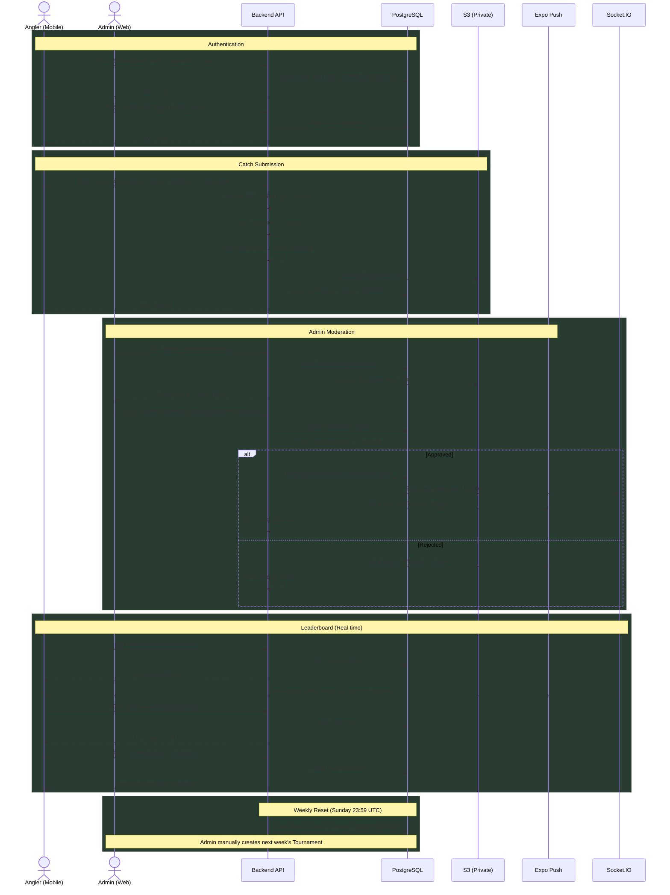

# FishLeague – App Architecture

## Sequence Diagram

```mermaid
sequenceDiagram
    actor Angler as Angler (Mobile)
    actor Admin as Admin (Web)
    participant API as Backend API
    participant DB as PostgreSQL
    participant S3 as S3 (Private)
    participant Push as Expo Push
    participant WS as Socket.IO

    %% ── Auth ──────────────────────────────────────────────
    rect rgb(40, 60, 50)
        Note over Angler,DB: Authentication
        Angler->>API: POST /auth/register (email + password + region)
        API->>DB: Create User, log USER_TERMS_ACCEPTED
        API-->>Angler: JWT token

        Angler->>API: POST /auth/apple (Apple identity token)
        API->>DB: Upsert User (appleId)
        API-->>Angler: JWT token
    end

    %% ── Submission ────────────────────────────────────────
    rect rgb(40, 60, 50)
        Note over Angler,S3: Catch Submission
        Angler->>API: POST /submissions (photo + GPS + lengthCm + matSerialId?)
        API->>API: Validate GPS inside region bounds
        API->>API: Check matSerial not reused
        API->>API: MD5 hash photo → check duplicate
        API->>S3: Upload photo (private key)
        API->>DB: Create Submission (status=PENDING)
        API-->>Angler: 201 Created
    end

    %% ── Moderation ────────────────────────────────────────
    rect rgb(40, 60, 50)
        Note over Admin,Push: Admin Moderation
        Admin->>API: GET /admin/moderation/pending
        API->>DB: Fetch PENDING submissions
        API->>S3: Generate presigned URLs (1hr)
        API-->>Admin: Submissions + photo URLs

        Admin->>API: POST /admin/moderation/:id/action (approve/reject/flag)
        API->>DB: Update Submission status
        API->>DB: Write ModerationAction + AuditLog

        alt Approved
            API->>DB: Upsert LeaderboardEntry, recompute ranks
            API->>WS: Broadcast leaderboard update
            API->>Push: Send push notification to Angler
            API->>API: Send approval email
        else Rejected
            API->>Push: Send push notification to Angler
            API->>API: Send rejection email
        end
    end

    %% ── Leaderboard ───────────────────────────────────────
    rect rgb(40, 60, 50)
        Note over Angler,WS: Leaderboard (Real-time)
        Angler->>API: GET /leaderboard/:tournamentId
        API->>DB: Fetch ranked entries
        API-->>Angler: LeaderboardEntry[]

        WS-->>Angler: leaderboard:update event (live push on approval)

        Angler->>API: POST /submissions/:id/props (toggle)
        API->>DB: Toggle Prop record
        API-->>Angler: { propped, count }

        Angler->>API: POST /submissions/:id/comments
        API->>DB: Create CatchComment
        API-->>Angler: CatchComment (with createdAt)
    end

    %% ── Weekly Reset ──────────────────────────────────────
    rect rgb(40, 60, 50)
        Note over API,DB: Weekly Reset (Sunday 23:59 UTC)
        API->>DB: Cron: close current Tournament (status=CLOSED)
        Note over Admin,DB: Admin manually creates next week's Tournament
    end
```
